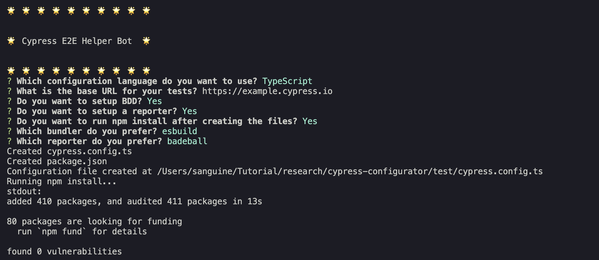

# cy-e2e

Are you a newbie in QA Engineering? Are you trying to ease your way into Automation? Have you been learning Cypress? Would you like to be able to set up Cypress with a BDD framework and reporter without stress?

If yes, this plugin is for you. Since I started training people in software automation, the majority of problems that I have had to help people resolve is usually around set up. Hence, the reason that I decided to create this plugin so that people can easily setup cypress.

You can create a cypress Template project that you can easily edit to suit your purpose.

## Installation
`npm install -g cy-e2e`

## Usage
 - After Installation, open the terminal in your desired directory and run `cy-e2e`

 ## Example

 Going through the questions looks like this

|    |
|:--:| 
| *BDD Typsecript Config with reporter selected* |

|  |
|:--:| 
| *Cypress Config with no BDD or reporter selected* |

|  |
|:--:| 
| *Cypress Project Created* |

 You can run the `npx cypress run` or `npx cypress open` command to see it execute.

 What's left is to continue to edit the template created to suit your needs

## Compatibility

It should be compatible with all versions of Cypress

## Support

[Issues](https://github.com/bhadmus/cy-config/issues)
